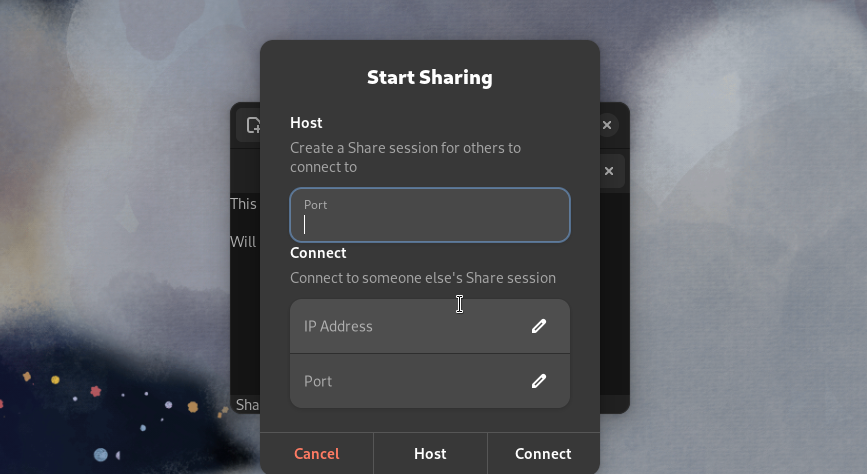

# App Name: TeXiT

This is a simple text editor built in C, utilizing GTK4, Libadwaita, and Blueprint Compiler packages. The main motivation behind the text editor is purely educational. We wanted to build an editor that, at the end, involves live editing with multiple individuals. To do it in C was an extra challenge for us. Although live editing is not implemented into our application as of now, we still intend to develop that into our application.

# Demo of App

So far our app contains:
- Open and Save files.
- Can have multiple files opened.
- Tab shows indicator when it has unsaved content.
- Client can connect to a Server and sync file contents.

In the future we plan to add:
- Setting Screen with more customizability options (font family, font size, code syntax coloring, etc.)
- Other miscellaneous additions to the app (word count, spellcheck, etc.).

### Issues

- Client can rearange tabs, which should not be allowed:
  - The program keeps track of tabs by index.
  - The order of the tabs is not synced, which mixes up the tab indexes.
- Having the Server and Client in the same machine causes some bugs.
  - Attempting to run multiple instances from different terminals will put all instances into the first terminal.
  - Globals are shared for all instances of the app.
    - When starting the server and then the client, the `connection_state` will be overridden to `Client`. Turning off the server through the *toggle button* will close the client instead.

# Install

Run the [install script](./install):
 - `./install sys`: Install it for all users (`/usr/local/`).
 - `./install user`: Install for just your user (`~/.local/`).
 - To uninstall the application on `sys` or `user`, run `./install sys uninstall` or `./install user uninstall` respectively.

Make sure to have all the [build dependencies](#build-dependencies) installed.

# Build Dependencies
 - ## GTK 4
   - Requires version `4.10` or above.
   - Unfortunately, this means this program can't be built in the current version of Ubuntu LTS (which uses version 4.6).
   - **Install** (Fedora):
     - `sudo dnf install gtk4 gtk4-devel`
 - ## Libadwaita
   - Requires [version `1.3`](https://gnome.pages.gitlab.gnome.org/libadwaita/doc/1.3/) or above.
   - **Install** (Fedora):
     - `sudo dnf install libadwaita`
 - ## Blueprint
    - Builds `.blp` files into `.ui` files that can be used by GtkBuilder. Install it [here](https://jwestman.pages.gitlab.gnome.org/blueprint-compiler/setup.html)

# Language Server (IDE)

If using `neovim` or `vscode`, clangd will need the file `compile_commands.json` to find gtk4 libraries.
To generate the file install [`bear`](https://github.com/rizsotto/bear) from your distro's package manager and run `bear -- make`.
